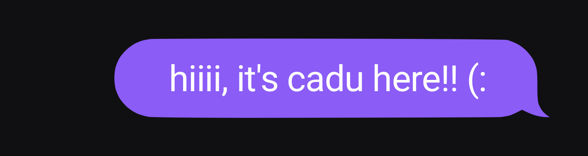
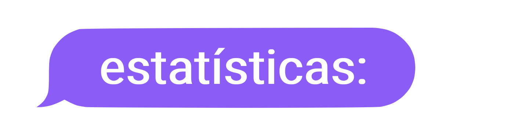

 

 

🟣 Estudo **Cibersegurança** na **Universidade Federal de Uberlândia** 
🟣 Aprendendo **Python 3**, com foco em **Programação Orientada a Objetos** (nível intermediário) 
🟣 Atualmente usando o GitHub como repositório de **trabalhos** universitários 
🟣 **Inglês fluente**, aprendendo **inglês técnico**

 

<table width="100%">
<tr>
<td width="50%" valign="top" align="left">

 

</td>
<td width="50%" valign="top" align="left">

 

</td>
</tr>
</table>

 

 

 

 

 

 

 

